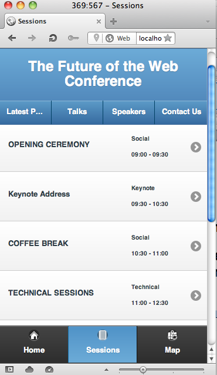

#CSM2220/SEM2220 Assessed Assignment 2013-14
##Assignment One: Mobile Web – Creating the Conference Sessions List Dynamically

> Chris Loftus

> Hand-out date: Tuesday 22nd October 2013

> Hand-in date: Monday 11th November 2013

> 20% of overall assessment

> (about 17 hours)

###The problem	
  
In the worksheets you have developed a simple conference web app using jQuery
Mobile, HTML5 etc. That app has hardcoded sessions data in the index.html page.
You will take the existing conference web app (a template partial solution is
provided) and add a small amount of code to populate the Sessions page dynamically
with session data:

The resulting page must look identical to the solution version used in earlier
worksheets.

###Approach	
1. Start by running the template project (attached on Blackboard). When you click on the Sessions tab the screen will be blank.
2. Analyse the index.html, the `Controller.js` file and the `DataContext.js` file. You will find `ENTER CODE HERE` comments in the two Javascript files. Those arethe only places (apart from the occasional variable declaration) that you will need to
add code to.
3. Incrementally add code. Start with `DataContext.js`. This file builds a SQL database using the widely supported Web SQL Database API. Be aware that not all browsers support it, but Opera, Chrome, Android Browser and others do. I have
provided most of the code but you will need to work out how to execute the provided query (provided as a comment) and then on success call the `processorFunc` function. Make sure you use the browser Developer Tools when debugging your code. I find it essential to step debug when writing Javascript! I will also ask you to provide some screenshots to demonstrate that you used it.
4. Add code to the `Controller.js` file. This is where the `processorFunc` call is defined (although it has a different name). I’ve provided detailed comments on what it needs to do, but essentially it builds up the HTML Sessions list dynamically based on data passed to it from `DataContext.js`.
5. After testing the app on browsers and a mobile web emulator (e.g. Opera Mobile Emulator) package up the app as a PhoneGap wrapped app (as we did in worksheets) and run on an Android emulator or a real device.
6. Write a three-page report that tells the story of how you went about implementing the assignment, problems encountered, what your learned and a few screen shots showing the solution running either on a real mobile device or Android emulator. Also include a screen shot of you using the browser Developer Tools (it can be any browser tool). Make sure you include an additional cover page with your name etc. **Please indicate in your report the mark you think you should be awarded and why.**
7. Package up your code, the apk file generated by PhoneGap and the report in a zip file and upload to Blackboard by 3pm Monday 4th November. I will need to deploy your apk files on an emulator.

If you are late then please complete a Late Assignment Submission form and hand
this in to the Department office. All required forms can be found at:
http://www.aber.ac.uk/~dcswww/intranet/staff-students-internal/teaching/resources.php

**Note:** this is an "individual" assignment and must be completed as a one-person effort by the student submitting the work.

This assignment is **not** marked anonymously.

I will attempt to provide provisional marks and feedback by the Monday 18th Novmber 2013

### Learning outcomes	
  
By undertaking this assignment, and the worksheets it builds on, you will:

1. Learn how to the Web SQL Database API.
2. Learn how to use some of the jQuery Mobile API.
3. Learn how to test web apps.
4. Learn how to create a hybrid web app that will run on a mobile device.
5. Enhance your Javascript and HTML5 abilities.

### Mark breakdown

Assessment will be based on the assessment criteria described in Appendix AA of the
Student Handbook. However, the following table gives you some indication of the
weights associated with individual parts of the assignment. This will help you judge
how much time to spend on each part.

#### Documentation (30%)
Does the documentation convey a convincing and detailed story of how the code was implemented, problems encountered, what was learned and an indication of the mark that should be awarded and why?

#### Implementation (50%)
Quality of the implementation in the two Javascript files.

#### Flair (10%)
You implemented and documented something in a way that really impresses me. I’ll know it when I see it.

#### Testing (10%)
You provided evidence of testing using browser developer tools.
